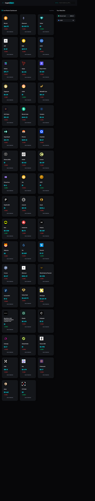

# 💎 CryptoWatch : Real-Time Market Pulse

**CryptoWatch** is a high-performance, asynchronous financial dashboard built with Vanilla JavaScript. It provides live market data, dynamic search capabilities, and persistent watchlist management, all wrapped in a modern, "Glassmorphism" inspired interface.

---

## 🚀 Key Features

* **Live Market Data:** Consumes the CoinGecko REST API using `async/await` and robust error handling.
* **Optimized Search:** Implements a **Debounce** pattern to minimize DOM re-renders and improve performance during user input.
* **Persistent Watchlist:** Manages user state across browser sessions using the **Web Storage API** (`localStorage`).
* **Event Delegation:** Efficiently handles user interactions on dynamically generated elements via a single parent listener.
* **Ultra-Modern UI:** Features a mobile-responsive, dark-mode aesthetic with CSS backdrop filters and neomorphic micro-interactions.

---

## 🛠️ Technical Deep Dive

### 1. Asynchronous Architecture
The application uses an asynchronous pipeline to fetch data without blocking the main thread.
* **Methods:** `fetch()`, `response.json()`, `try...catch`.
* **Logic:** Data is fetched, stored in a global state for instant filtering, and then piped into a rendering engine.

### 2. Performance Optimization
To ensure the app remains snappy on all devices, two critical patterns were implemented:
* **Debouncing:** Input listeners are wrapped in a 300ms timer. This ensures the search logic only executes after the user stops typing.
* **Event Delegation:** Instead of attaching 50+ listeners to "Add to Watchlist" buttons, a single listener is attached to the market grid, utilizing `event.target.closest()` for precise targeting.

### 3. State Synchronization
The app maintains a "Single Source of Truth."
* **Serialization:** Complex JavaScript objects are serialized into strings using `JSON.stringify()` for storage and parsed back using `JSON.parse()` for application logic.
---

## 📖 Concepts Mastered
Building this project served as a comprehensive review of modern ES6+ JavaScript:

Mastering the Event Loop: Understanding how async/await interacts with the browser's execution stack.

DOM In-Depth: Moving away from manual node creation to efficient string-template rendering.

Clean Code Patterns: Decoupling the "Fetch" logic from the "UI" logic to make the codebase more maintainable.

## 🔧 Installation & Setup
Clone the repository:

git clone [https://github.com/your-username/cryptowatch-pro.git](https://github.com/your-username/Crypto-watch.git)

## 🛡️ License
Distributed under the MIT License.
